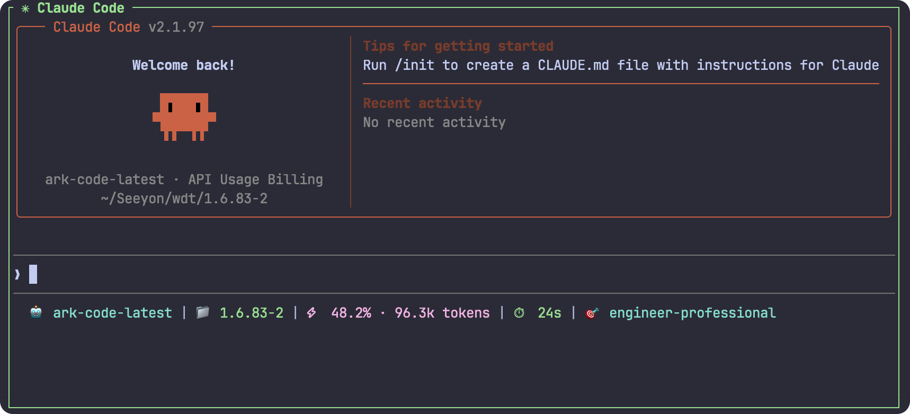
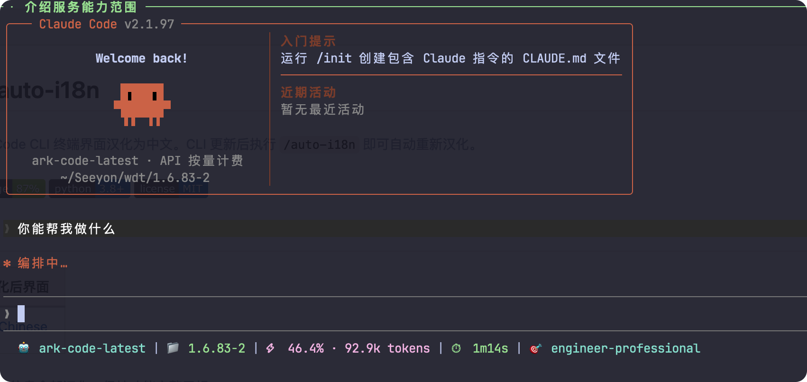

# Claude Code auto-i18n

> 🇨🇳 一键将 Claude Code CLI 终端界面汉化为中文。CLI 更新后执行 `/auto-i18n` 即可自动重新汉化。

[](https://github.com/huiyi9420/claude-code-i18n/actions/workflows/tests.yml)
[](https://github.com/huiyi9420/claude-code-i18n/actions)
[](https://www.python.org)
[](LICENSE)

## 效果展示

| 英文原生界面 | 汉化后界面 |
|-------------|------------|
|  |  |

> 💡 菜单、提示、状态信息全部汉化，保持功能完整无损。

## 功能特性

- **✅ 一键汉化** — `/auto-i18n` 完成提取、翻译、应用、验证全流程
- **✅ 自我进化** — CLI 更新后 `/auto-i18n auto-update` 自动适配新版本
- **✅ 规则引擎** — 内置 400+ 翻译条目 + 自动翻译词典 + 动词模式匹配
- **✅ 安全保障** — 三级替换策略 + Hook 专门处理 + 语法验证 + 失败自动回滚
- **✅ 完全可逆** — `/auto-i18n restore` 一键恢复英文原文
- **✅ Volta 兼容** — 自动检测双路径并同步，Volta 安装也能正常使用
- **✅ 测试完备** — 265+ 单元测试，87% 覆盖率，质量保证

## 快速开始

### 安装

```bash
# GitHub
git clone https://github.com/huiyi9420/claude-code-i18n.git
# 或 GitLab
# git clone https://gitlab.com/你的用户名/claude-auto-i18n.git

cd claude-code-i18n
bash install.sh
```

安装脚本会自动：
1. 检查 Python 3 和 Node.js 环境
2. 创建 `~/.claude/scripts/i18n/` 目录结构
3. 复制所有引擎模块
4. 安装翻译数据
5. 安装 `/auto-i18n` 技能命令
6. 验证所有文件完整性

### 使用

安装完成后**重启 Claude Code**，即可使用：

| 命令 | 功能 |
|------|------|
| `/auto-i18n` | 一键汉化（检测版本→提取字符串→AI 翻译缺失→应用汉化→验证） |
| `/auto-i18n auto-update` | CLI 更新后自动重新汉化（推荐） |
| `/auto-i18n restore` | 一键恢复英文原文 |
| `/auto-i18n status` | 查看当前汉化状态 |
| `/auto-i18n coverage` | 查看翻译覆盖率统计 |

### 命令行（不依赖技能命令）

如果你不想使用 Claude Code 技能命令，也可以直接命令行调用：

```bash
python3 ~/.claude/scripts/engine.py apply       # 应用汉化
python3 ~/.claude/scripts/engine.py auto-update  # 自我进化（CLI 更新后）
python3 ~/.claude/scripts/engine.py restore      # 恢复英文
python3 ~/.claude/scripts/engine.py status       # 查看状态
python3 ~/.claude/scripts/engine.py coverage     # 覆盖率报告
python3 ~/.claude/scripts/engine.py extract      # 提取新字符串
```

## 工作原理

### 架构

```
备份(cli.bak.en.js) → 扫描候选字符串 → 规则自动翻译 → AI 翻译剩余
    → 三级替换(长/中/短) → Hook 替换 → 语法验证 → 写入 cli.js
```

### 替换策略

| 长度 | 策略 | 说明 |
|------|------|------|
| > 20 字符 | 全局替换 | 精度高，误伤概率极低 |
| 10-20 字符 | 引号上下文替换 | 只替换引号内的出现 |
| < 10 字符 | 边界感知替换 | 限制替换数量上限 + skip words |

### 自我进化流程

`auto-update` 一键编排：

1. 版本变更检测（自动重建备份）
2. 从纯净备份扫描新字符串
3. 与上次快照 diff（新增/变更/移除）
4. 规则引擎自动翻译高置信度字符串
5. 低置信度字符串标记人工审核
6. 合并翻译映射表
7. 应用汉化 + Hook 替换
8. `node --check` 语法验证（失败自动回滚）

## 项目结构

```
claude-code-i18n/
├── commands/
│   └── auto-i18n.md          # Claude Code 技能命令
├── scripts/
│   ├── engine.py              # CLI 入口
│   ├── zh-CN.json             # 中英翻译映射表
│   ├── skip-words.json        # 跳过词列表
│   ├── auto-translate-dict.json # 自动翻译词典
│   └── i18n/                  # 引擎模块
│       ├── cli.py             # argparse 子命令路由
│       ├── config/            # 常量、路径检测
│       ├── io/                # 备份、文件IO、翻译映射、快照
│       ├── core/              # 扫描、替换、验证、Hook、自动翻译
│       ├── filters/           # 噪声过滤、UI 指示器
│       └── commands/          # apply/extract/status/restore/auto-update
├── tests/                     # pytest 测试套件
├── install.sh                 # 安装脚本
└── README.md
```

## 自定义翻译

编辑 `~/.claude/scripts/i18n/zh-CN.json` 的 `translations` 字段添加自定义翻译：

```json
{
  "_meta": { "version": "4.0.0", "cli_version": "2.1.92" },
  "translations": {
    "English text": "中文翻译"
  }
}
```

修改后再次执行 `/auto-i18n` 即可应用。

## 支持的安装方式

| 安装方式 | 支持状态 |
|----------|----------|
| npm 全局安装 | ✅ 支持 |
| Volta 安装 | ✅ 支持（自动双路径同步） |
| 自定义路径 | ✅ 支持（设置 `CLAUDE_I18N_CLI_DIR` 环境变量） |

## 系统要求

- macOS / Linux
- Python 3.8+
- Node.js（语法验证需要）
- Claude Code CLI

## 故障排除

| 问题 | 解决方案 |
|------|---------|
| CLI 更新后汉化失效 | 执行 `/auto-i18n auto-update` 自动重新汉化 |
| 汉化后 CLI 界面仍是英文 | 检查 Volta 双路径，执行完后会自动同步。如果还是英文，手动同步：`cp ~/.volta/tools/image/packages/@anthropic-ai/claude-code/lib/node_modules/@anthropic-ai/claude-code/cli.js ~/.volta/tools/image/node/$(basename ~/.volta/tools/image/node/*)/lib/node_modules/@anthropic-ai/claude-code/cli.js` |
| 语法验证失败 | 会自动回滚，通常是翻译中包含了未转义的双引号 `"`，改用中文引号 `「」` |
| 找不到 cli.js | 设置环境变量指定路径：`export CLAUDE_I18N_CLI_DIR=$(dirname $(which claude))/../lib/node_modules/@anthropic-ai/claude-code` |
| 想恢复英文 | 执行 `/auto-i18n restore`，恢复后也需重启 |
| Volta 更新 Node 后汉化消失 | 重新执行 `/auto-i18n` 即可，会自动同步到新的 Node 版本路径 |

## 架构

```
claude-code-i18n/
├── commands/
│   └── auto-i18n.md          # Claude Code 技能命令定义
├── scripts/
│   ├── engine.py              # 命令行入口
│   ├── zh-CN.json             # 中英翻译映射表
│   ├── skip-words.json        # 跳过不翻译的标识符
│   ├── auto-translate-dict.json # 自动翻译词典（规则引擎）
│   └── i18n/                  # 引擎核心模块
│       ├── cli.py             # argparse 子命令路由
│       ├── config/            # 常量配置、路径检测
│       ├── io/                # 备份、文件IO、翻译映射IO
│       ├── core/              # 扫描、替换、验证、Hook处理
│       ├── filters/           # 噪声过滤、UI指示器识别
│       └── commands/          # 各子命令实现（apply/extract/status等）
├── tests/                     # pytest 测试套件（265+ 测试）
├── .github/
│   └── workflows/
│       └── tests.yml          # GitHub Actions CI
├── install.sh                 # 一键安装脚本
└── README.md
```

## 工作原理

```
备份原文件(cli.bak.en.js)
    ↓
扫描候选字符串（引号边界匹配）
    ↓
规则引擎自动翻译（词典匹配）
    ↓
AI 翻译剩余未知字符串（Claude 帮忙翻译）
    ↓
三级替换策略（按长度区分）
    ↓
Hook 特定模板替换
    ↓
node --check 语法验证
    ↓
写入文件 → Volta 同步 → 完成
```

### 替换策略

| 字符串长度 | 策略 | 说明 |
|------------|------|------|
| > 20 字符 | 全局精确替换 | 精度高，误伤概率极低 |
| 10-20 字符 | 引号上下文替换 | 只替换引号内的出现 |
| ≤ 10 字符 | 边界感知替换 | 结合跳过词表，安全翻译短 UI 标签 |

### 自我进化流程

`auto-update` 一键完成：

1. 版本变更检测，自动重建备份
2. 从纯净备份扫描提取字符串
3. 与上次快照 diff → 新增/变更/移除
4. 规则引擎自动翻译高置信度字符串
5. 低置信度标记需人工审核
6. 合并到翻译映射表
7. 应用汉化 + Hook 替换
8. `node --check` 语法验证（失败自动回滚）

## 贡献

欢迎提交 Issue 和 Pull Request！

主要贡献方式：

1. **翻译改进** — 修改 `scripts/zh-CN.json` 中的翻译
2. **词典扩展** — 添加 `scripts/auto-translate-dict.json` 中的自动翻译规则
3. **Bug 修复** — 提交 issue 或 PR
4. **文档改进** — 改进 README 或添加使用说明

开发测试：
```bash
python3 -m pytest tests/ -v
# 查看覆盖率
python3 -m pytest tests/ -v --cov=scripts --cov-report=html
open htmlcov/index.html
```

## 截图预览

你可以在 `assets/` 目录添加截图：

- `assets/screenshot-english.png` - 英文界面对比
- `assets/screenshot-chinese.png` - 汉化后效果

## License

MIT License - 详见 [LICENSE](LICENSE)

